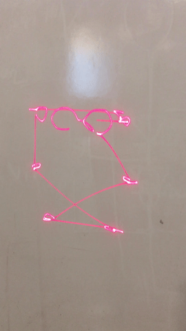

# G.E.R.T : Golang Embedded Run-Time
 

GERT is a modified version of Go that runs bare-metal on armv7a SOCs. The minimal
set of OS primitives that Go relies on have been re-implemented entirely in Go
and Plan 9 assembly inside the modified runtime. The goal of this project is to bring
the benefits of a high-level, type-safe, and garbage-collected language to bare-metal
embedded environments. GERT has been developed for the Wandboard Quad (iMX6 Quad SOC), but
GERT can be ported to any armv7a SOC with adequate documentation.

## Features
+ Improved latency compared to Linux user-space C
+ All of Go's concurrency features, such as goroutines and channels, on bare-metal
+ Greater portability than bare-metal C
+ Drivers written for the iMX6 UART, SPI, SDCARD, GPT, IOMUX and much
  more

## Quickstart

### Materials Needed

GERT can either run in the QEMU emulator or on real hardware. To emulate GERT you must install QEMU. Follow the install instructions
below because they include a QEMU installation. To run GERT on real hardware,
you will need to get a **Wandboard Quad** and an SD card, or any other dev kit which uses the Freescale
iMX6 Quad SOC. GERT only works with the iMX6 right now because its memory map is hard-coded into
the kernel. I plan to bring GERT to the raspi eventually, but don't wait
for me, feel free to contribute!

### Directory Layout
  |Directory | Function |
  |----------|----------|
  |`golang_embedded`| Modified Go runtime which runs on bare-metal. It has its own repo which explains modifications in detail|
  |`qemu`| QEMU git master branch. submoduled|
  |`thesis`| My master's thesis. Contains a pretty detailed description of this work. It may eventually become outdated|
  |`gert/armv7a`| Contains the user-facing code for running GERT on the Wandboard Quad dev board|
  |`gert/armv7a/uboot_bin`| Images for the U-boot bootloader, which configures basic device clocks and loads GERT off the sd card|
  |`gert/armv7a/boot`|  Second-stage bootloader written in C that prepares the initial Go stack|
  |`gert/armv7a/embedded`| Go package which contains many drivers for the iMX6 Quad cpu|
  |`gert/armv7a/doc`| Technical reference manuals on the armv7a, cortex-a9 mpcore architectures, and iMX6 SOC|
  |`gert/armv7a/programs`| A storage directory for some GERT programs|
  |`gert/armv7a/measurements`| Benchmarks and measurements I took for my thesis|
  |`gert/armv7a/debug`| JTAG scripts for the JLink EDU|

### Installation
These commands will build QEMU from source and also download all of the
dependencies required to build GERT and the Go runtime.

#### Ubuntu

First, in ~/.bashrc, put `export GOROOT_BOOTSTRAP=$(go env GOROOT)`
Then make sure you have the `deb-src` repositories uncommented in `/etc/apt/sources.list`.

  <!-- language: lang-none -->

     sudo apt install gcc-arm-none-eabi gdb-arm-none-eabi golang git
     sudo apt-get build-dep golang qemu
     git clone git@github.com:ycoroneos/G.E.R.T.git
     cd G.E.R.T
     git submodule update --recursive --init
     cd qemu && ./configure --target-list=arm-softmmu && make -j4 && cd ..
     cd gert/armv7a && make runtime && UPROG=programs/hello make && make qemu

If all went well, you should be running the 'hello' program in QEMU.
Press CTRL+A then X to quit QEMU.

### Programming With GERT

GERT programs live inside the `gert/armv7a/programs` directory. Each program folder
must contain three things: `kernel.go`, `irq.go`, and `userprog.go`. Take a look at
`programs/hello` to get a feel for the layout, then look at
`programs/gopher` to see how to interface a laser projector. Remember that GERT programs are Go
programs. Besides for the quirky layout and the few constraints listed
below, you should go about programming in GERT as you do in Go.

#### kernel.go

This is not the actual GERT kernel, but it contains the GERT entry point,
initialization for the interrupt controller, and code to enable all 4 cpus
on the iMX6. It's boilerplate code you would have written anyway. The
actual GERT kernel is in the `golang_embedded` repo

#### irq.go

Contains the interrupt service routine that GERT executes when a cpu
gets an interrupt (switches to ISR mode). Every cpu can concurrently execute
in the interrupt handler; interrupts are not serialized. There are some basic rules
you must obey inside the interrupt handler though : **no blocking operations
and no allocations on the heap**. This is because the garbage collector might be running
while an interrupt is being serviced. The *irqnum* input is the ID of the SPI
that was received. You must enable the specific interrupts you want to receive
in the ARM GIC before the interrupt handler will ever execute. Look in
the doc folder for GIC documentation.

#### userprog.go

This contains your GERT program. There are at least two functions you must implement:
*user_init*, which is called once, and *user_loop*, which is called repeatedly.
Most of the standard libraries work as well as channels and goroutines. The *embedded* package
contains drivers for many iMX6 peripherals for you to play around with.
If you find a standard library that doesn't work (and you want it to
work), then either make an issue on github or submit a fix.

### Working With GERT

`gert/armv7a` is the working directory so you should execute all commands from in there. Everytime you change the runtime run `make runtime`.
To build a GERT program, run `UPROG=<your prog dir> make`. To run your GERT program in QEMU do `make qemu`.
To put your GERT program on an sd card and boot it run `SDCARD=/dev/<your sdcard> make sdcard`

## Debugging

Many bugs in a GERT program result in a Go panic, which prints a very useful backtrace along with a useful
error message. This is usually enough to fix the problem. If the bug is
serious, it may be a kernel bug. If you still want to tackle it, then look in my thesis for an overview of
the different kernel components and the virtual memory map.
`gert_arm.go` inside the `src/runtime` folder of the Go runtime has the
majority of the GERT kernel.

### QEMU

Try to reproduce your error in QEMU. It will significantly reduce debugging time.
Run your faulty GERT program with `make qemud` and connect to it with `gdb-arm-none-eabi`. GERT programs
are compiled with debugging symbols and Go has excellent support for GDB.

### JTAG

QEMU does not emulate most of the iMX6 peripherals or cpu very well. You may need to use a JTAG adaptor
to step single instructions on the actual hardware. There are JTAG scripts for attaching to specific
Cortex A9 cores inside the `gert/armv7a/debug` directory. These scripts each setup a gdb server that
you can connect to with `gdb-arm-none-eabi` again. These scripts work for the Segger JLink
EDU. They can probably work with other Segger products but not with OpenOCD.

